# OpenCV的安装与开发环境配置

## 0x00 准备工作
* Windows 10 x64
* Visual Studio 2019
* OpenCV 4.1.1安装包

## 0x01 安装OpenCV
1. OpenCV的安装包其实是一个自解压文件，用压缩软件打开后可以自行选择需要解压的部分。将压缩包内的opencv文件夹下的文件解压到`F:\Program Files\OpenCV\v411`下，这么做是为了方便同时安装多个版本的OpenCV。
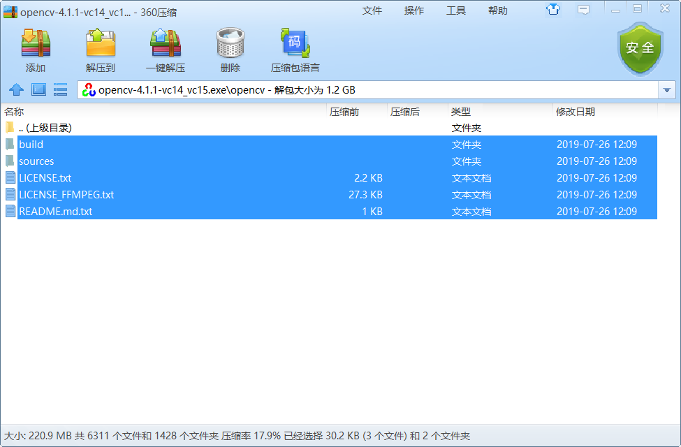

2. 解压好后还需要配置环境变量，在【Path】中添加`F:\Program Files\OpenCV\v411\build\x64\vc15\bin`，依次确定返回。OpenCV取消了预置的x86版本，同时我们选择较新的vc15(VS 2017)编译的版本。[^1]
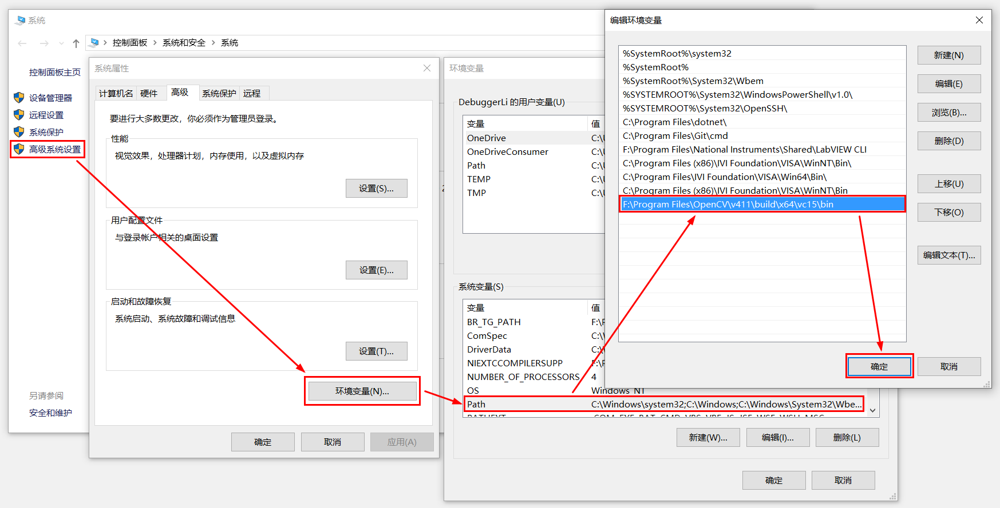

## 0x02 配置VS 2019工程属性
1. 打开VS 2019，点击【创建新项目】，选择【空项目】，选好位置后点击【创建】。
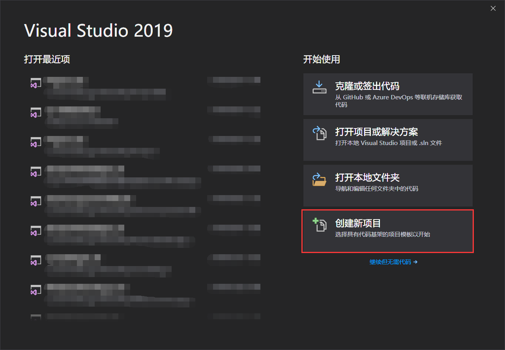

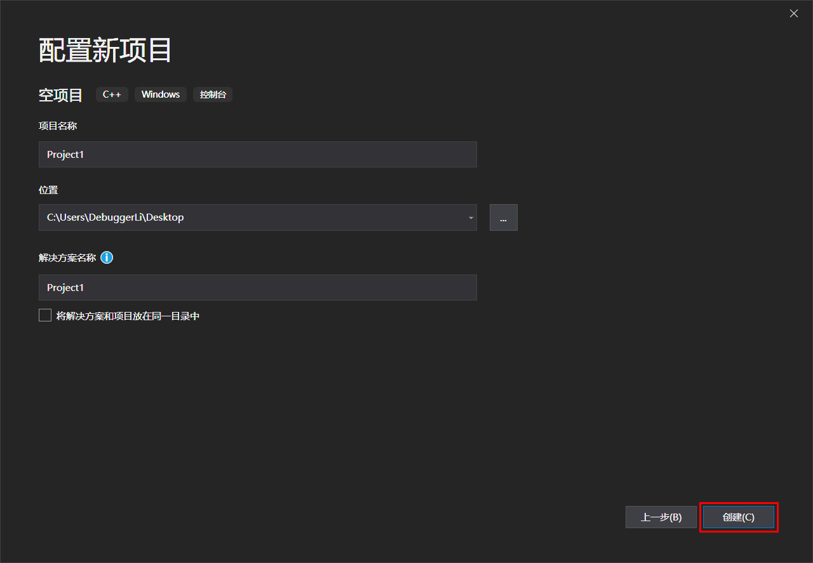

2. 在【视图】>【其他窗口】中打开【属性管理器】。
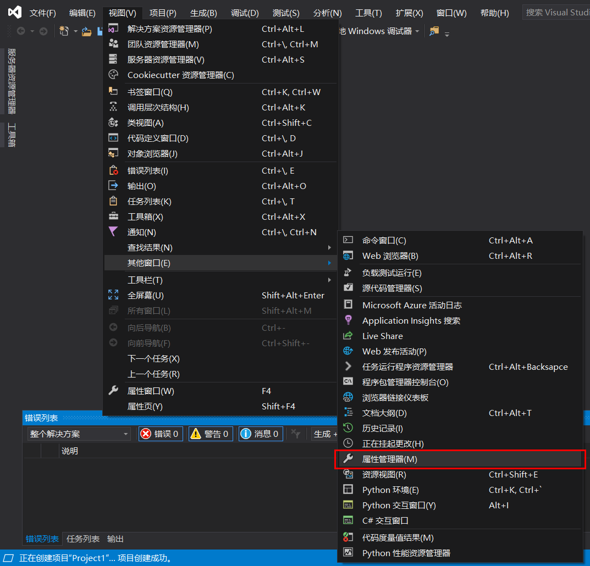

3. 右键【Debug|x64】，点击【添加新项目属性表】，修改名称为`OpenCV.411.Debug.x64`。

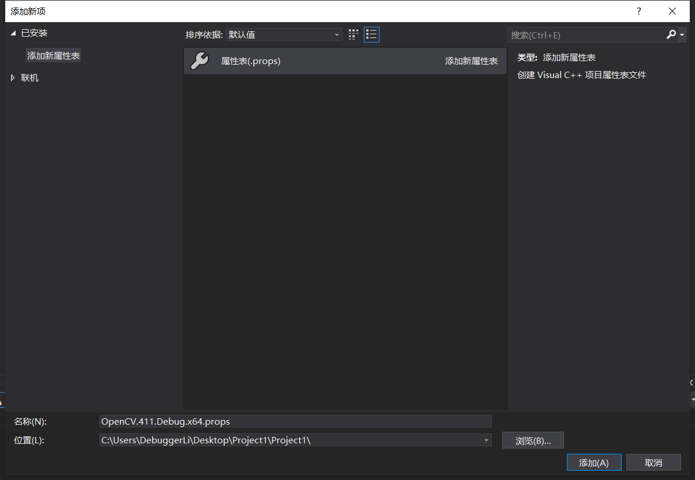

4. 双击新建的`OpenCV.411.Debug.x64`属性表，在【通用属性】>【VC++目录】>【包含目录】中点击编辑。双击空行，点击右边【...】，添加`F:\Program Files\OpenCV\v411\build\include`和`F:\Program Files\OpenCV\v411\build\include\opencv2`两个文件夹，点击确定。注意需要勾选【从父级或项目默认设置继承】。
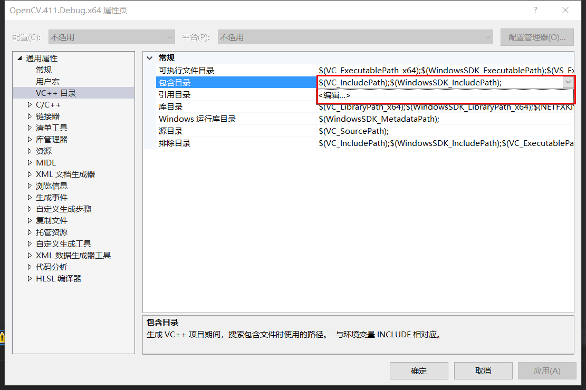

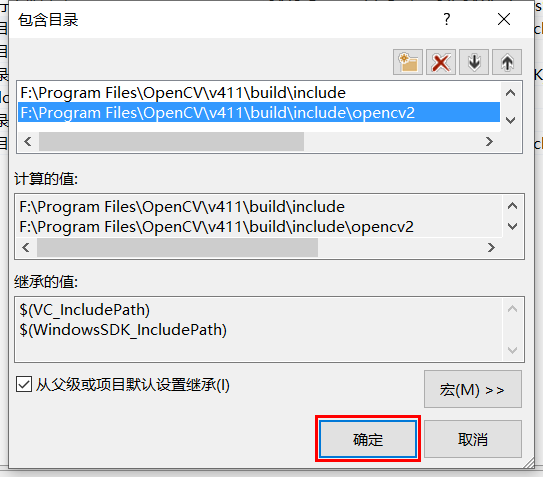

5. 接着在【库目录】中点击编辑，用同样的方法添加`F:\Program Files\OpenCV\v411\build\x64\vc15\lib`文件夹，点击确定。
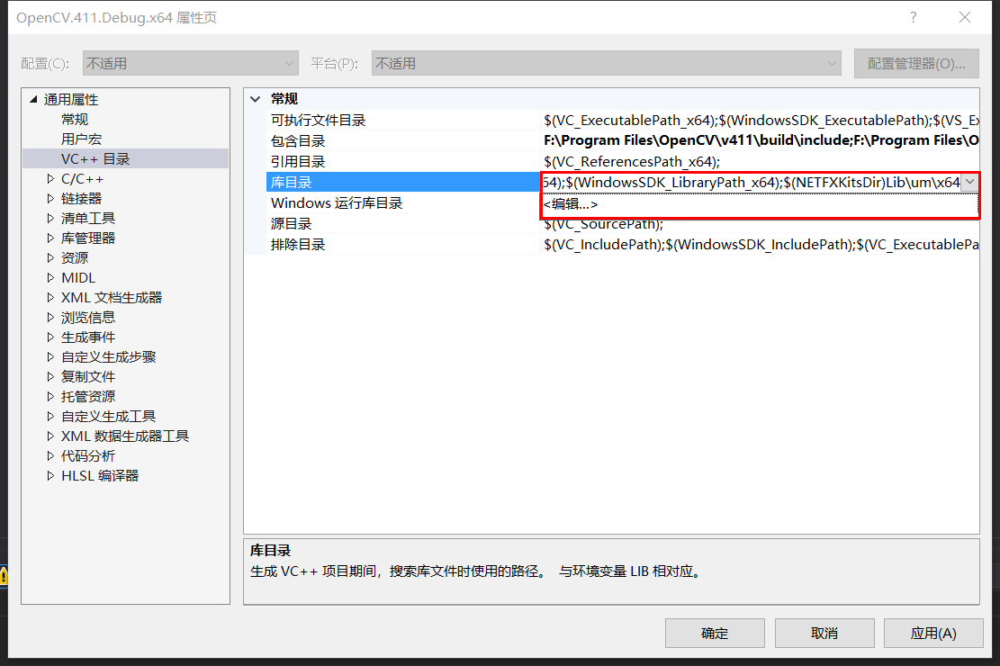
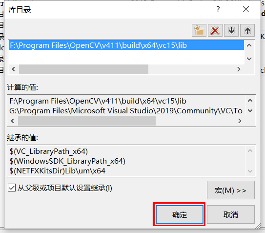

6. 在【通用属性】>【链接器】>【输入】>【附加依赖项】中点击编辑，输入`opencv_world411d.lib`，点击确定。因为我们现在的属性表对应Debug版，所以需要有后缀d的lib文件。最后点击确定，关闭属性页。
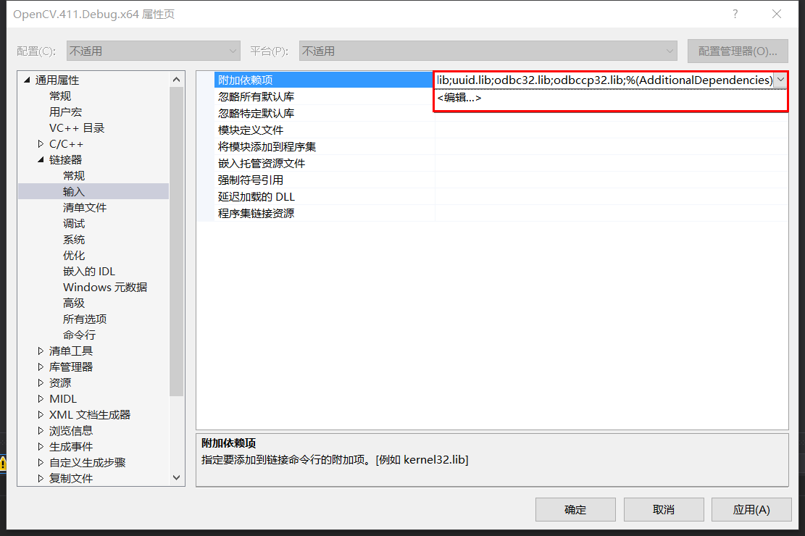


7. 测试，在【解决方案资源管理器】中新建源文件，输入测试代码，将图片文件放入main.cpp同一目录中。【解决方案配置】默认为Debug，【解决方案平台】改为x64，编译运行。
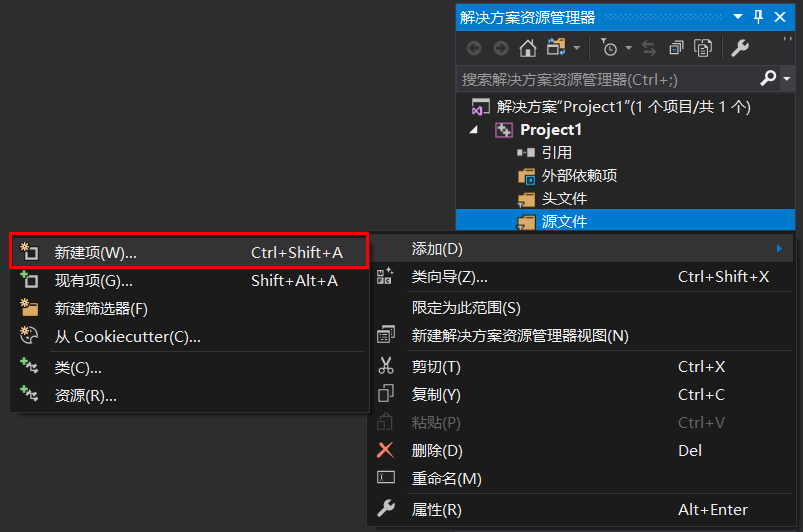
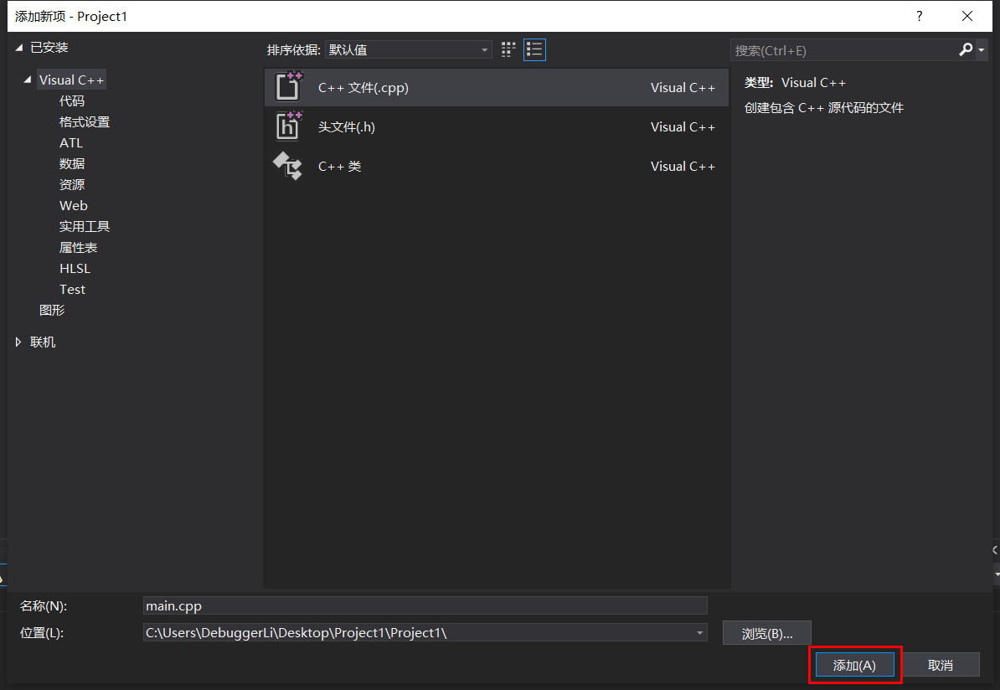

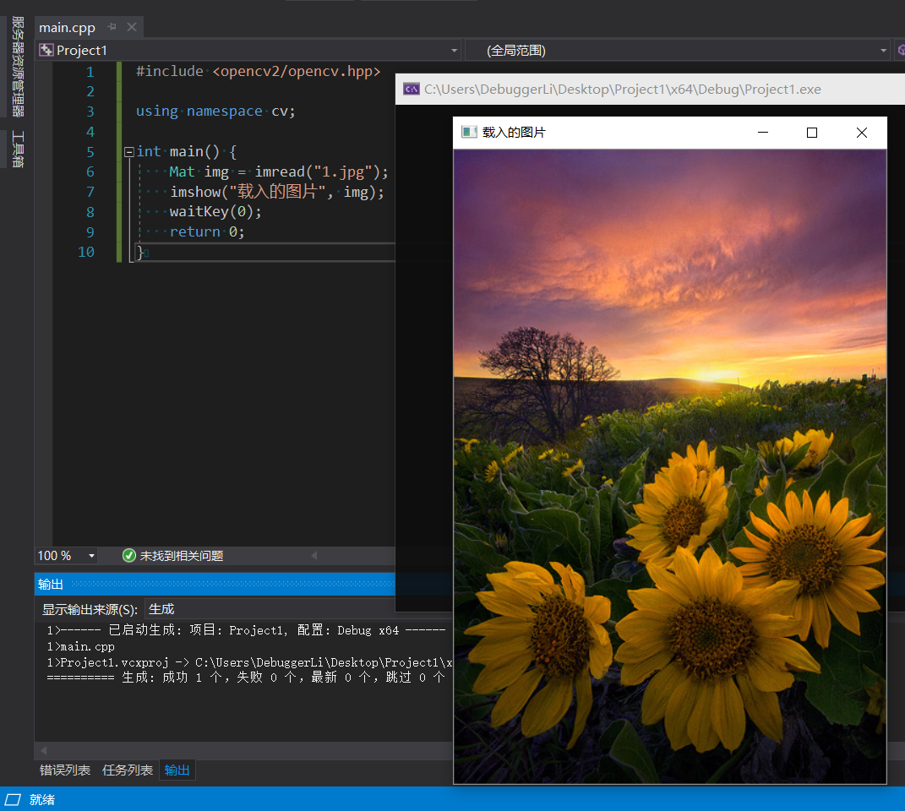

测试代码：
```cpp
#include <opencv2/opencv.hpp>

using namespace cv;

int main() {
    Mat img = imread("1.jpg");
    imshow("载入的图片", img);
    waitKey(0);
    return 0;
}
```

8. 在项目文件夹下找到`OpenCV.411.Debug.x64.props`文件，复制为`OpenCV.411.Release.x64.props`，用记事本打开，将【AdditionalDependencies】中的`opencv_world411d.lib`改为`opencv_world411.lib`，也就是删除一个d，保存退出。这样完成了Release版的属性配置。
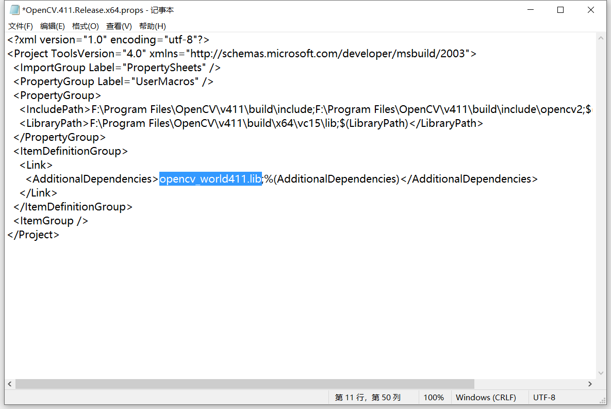

9. 在【属性管理器】中右键【Release|x64】，点击【添加现有属性表】，将刚刚的Release版的属性表文件添加进去。
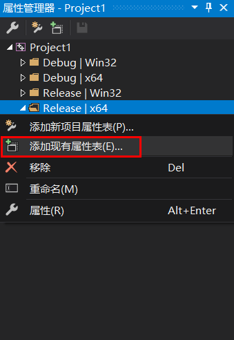
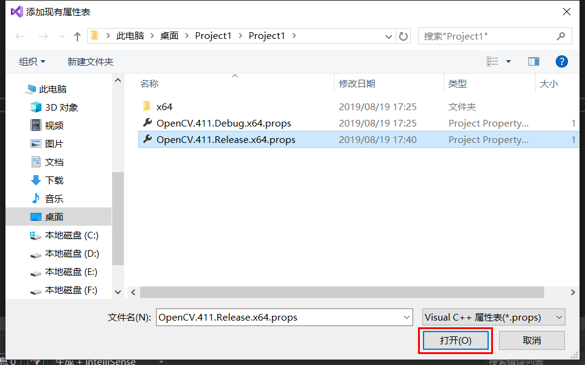
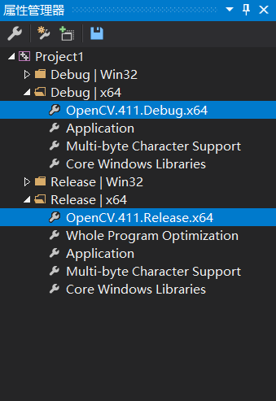

10. 将【解决方案配置】改为Release，再次编译运行。确认没有问题后，将两个属性表文件保存好，以后新建项目添加属性表即可完成OpenCV开发环境的配置。


## 0x03 注意事项
1. 有教程说要将`F:\Program Files\OpenCV\v411\build\x64\vc15\bin`里面的`opencv_world411.dll`、`opencv_world411d.dll`、`opencv_videoio_ffmpeg411_64.dll`这三个文件复制到`C:\Windows\System32`下，经测试发现不需要复制也可以正常编译运行。如果出现找不到文件的情况再复制吧。
2. VS 2019默认没有`Microsoft.Cpp.x64.user`文件，所以需要自行创建。
3. 添加附加依赖项时Debug和Release的lib不要同时添加，最好分开。

[^1]: VC与VS版本的对应关系：VC6=VS6，VC7=VS2003，VC8=VS2005，VC9=VS2008，VC10=VS2010，VC11=VS2012，VC12=VS2013，VC14=VS2015，VC15=VS2017。